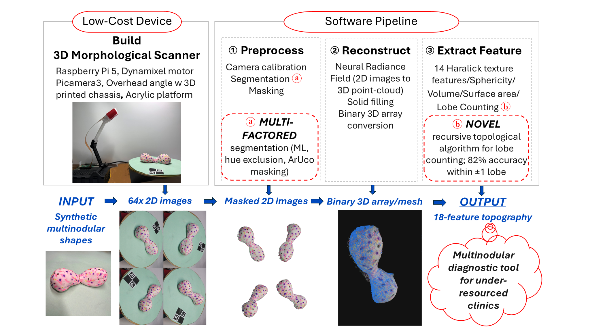

# MorphoScanner

[](LICENSE)
[](https://python.org)

---

This repository contains the code for MorphoScanner, my automated 3D scanning and volumetric analysis tool.


## System Architecture


*Figure 1. System architecture and end-to-end workflow of the low-cost 3D morphological scanner.*

---

### 1. Hardware
* **Microcontroller:** Raspberry Pi 5 (8GB)
* **Optical Sensor:** Raspberry Pi Camera Module 3
* **Rotary Actuator:** Robotis Dynamixel XL-430-W250-T
* **Stage & Calibration:** Laser-cut 0mm acrylic platter, green paper background, and ChArUco tags

### 2. Software Pipeline

* **Stage 1**: Image Preprocessing 
* **Stage 2**: Multi-Factor Segmentation
* **Stage 3**: Calibration & Pose Alignment
* **Stage 4**: Neural Radiance Field Optimization (NeRF)
* **Stage 5**: Point Cloud Raycasting
* **Stage 6**: 2.5D Solid Extrusion & Voxelization
* **Stage 7**: Orbiting Visualization
* **Stage 8**: Mask Reprojection
* **Stage 9**: Feature Extraction
* **Stage 10**: Visualization

See `demo.md` for a demonstration run on the `tests_and_images/captures_8-16_lesion_3` dataset and more detailed software pipeline documentation.

## Benchmarking

| Benchmark Reference | Ground Truth CAD | Reconstructed Dimension | Absolute Error | Percentage Error |
| :--- | :--- | :--- | :--- | :--- |
| **4.00 cm Green PLA Cube (Width $X$)** | $40.00\text{ mm}$ | **$40.28\text{ mm}$** | **$+0.28\text{ mm}$** | **$0.70\%$** |
| **4.00 cm Green PLA Cube (Depth $Y$)** | $40.00\text{ mm}$ | **$40.42\text{ mm}$** | **$+0.42\text{ mm}$** | **$1.05\%$** |
| **4.00 cm Green PLA Cube (Height $Z$)** | $40.00\text{ mm}$ | **$39.81\text{ mm}$** | **$-0.19\text{ mm}$** | **$0.47\%$** |

---

## How To Use

### Capture Data Images with Scanner

```bash
# Create new directory for data
mkdir DATA_DIRECTORY

# Capture images
python combine_test.py DIRECTORY_PATH
```

### Software Pipeline

```bash
# General automated run (auto-timestamped, 2000 steps)
./tools/run_pipeline.sh <raw_captures_dir> tests_and_images/captures_8-13_calibration_results/calibration.json --steps 2000

# High-resolution convergence run (20,000 steps)
./tools/run_pipeline.sh <raw_captures_dir> tests_and_images/captures_8-13_calibration_results/calibration.json --steps 20000
```
