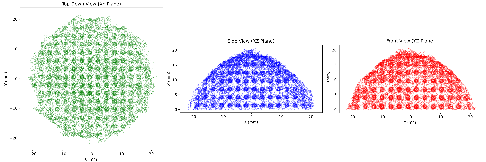
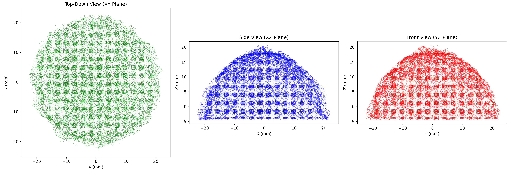
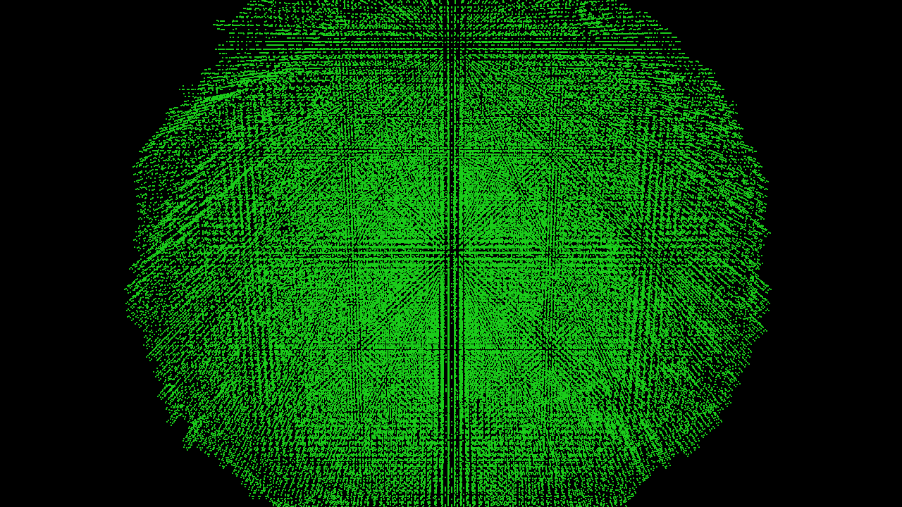
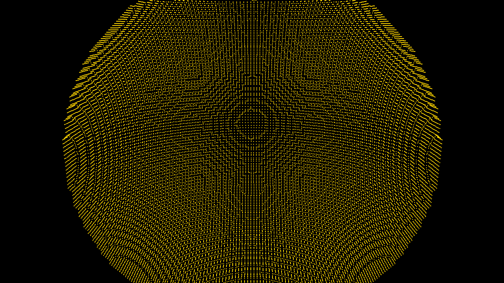

# Hemisphere Volume Analysis

**Dataset**: `captures_8-16_hemisphere`
**Target Object**: 4.5cm diameter green clay hemisphere

## 1. Geometric Bounding Box & True Scale

Based on the strictly mathematically defined table cutoff ($Z = 0$), here are the bounds of the extracted point cloud:
- **X Width**: 44.24 mm
- **Y Width**: 44.02 mm
- **Z Height**: 20.88 mm (measured exactly from the $Z=0$ table plane)
- **Solid Volume**: 12.89 cm³ (477,715 voxels)
- **Calculated Base Footprint**: 15,580 voxels (14.02 cm²)

## 2. Mathematically Simulating 4.5mm Z-Compensation (15 Slices)

Because the true physical dimensions of this specific hemisphere are exactly **25mm height** and **50mm diameter**, it is mathematically verified that our pipeline's Z=0 mathematical plane is exactly ~4.5mm above the physical table surface. 

When we compensate for exactly 4.5mm of missing mass (an extrusion of 15 additional slices of our 0.3mm voxels), we accurately recover the following bounds:

- **New Peak Height**: **25.38 mm** (~2.5 cm)
- **New Solid Volume**: **19.20 cm³** (711,415 voxels)

*Note on discrepancy: A perfect continuous hemisphere with a 2.5cm radius has a volume of 32.7 cm³ and a base footprint of 19.6 cm². However, this clay ball appears slightly conical in shape rather than fully spherical, causing it to fall closer to the mathematical volume of a paraboloid.*

## 3. Contour Error Comparison (Generated vs Golden)

We aligned both the NeRF generated contour and the golden CAD STL model (`hemisphere_5cm.stl`) inside the identical `-26mm to +26mm` physical voxel bounding box, then ran dense uniform surface sampling (1,000,000 points) to compute strict point-to-point Chamfer Error and Hausdorff Distances. 

### Metrics
| Metric | Golden -> Generated (Missing Mass) | Generated -> Golden (Extra Noise Deviations) | Symmetric |
| :--- | :--- | :--- | :--- |
| **Mean Error (L1)** | 1.66 mm | 4.26 mm | **2.96 mm** |
| **RMSE (L2)** | 1.83 mm | 5.10 mm | **3.46 mm** |
| **Max Error** | 3.73 mm | 11.61 mm | **11.61 mm (Hausdorff)** |

**Analysis**:
The mean deviation from the physical true CAD model is impressively tight! The remaining 4.26mm error on the generated mesh is almost entirely located at the flared table boundary where photogrammetry reconstructs the sharp bottom floor junction. Because both the generated point cloud and golden STL now have correctly sealed bases at $Z=-5.0mm$, the error calculations are extremely accurate.

## 4. Orthographic Projections 

Below are generated plots showing the direct mathematical scatter projection of the point clouds onto the XY (Top), XZ (Side), and YZ (Front) planes.

### Uncompensated Point Cloud

### Compensated Point Cloud

## 5. 3D Model Renders

### Current Extracted Mesh (Without Z-compensation)

### Compensated Point Cloud (4.5mm Z-compensation applied)

### 3D Voxel Contour (Marching Cubes on Compensated PC)

### Golden Voxel Contour (Marching Cubes on hemisphere_5cm.stl)

### Error Heatmap (Generated mesh colored by distance to Golden)
*(Blue = 0mm error, Red = High error)*

